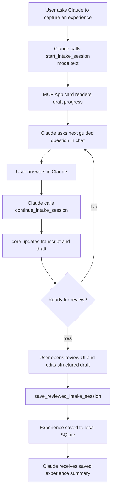
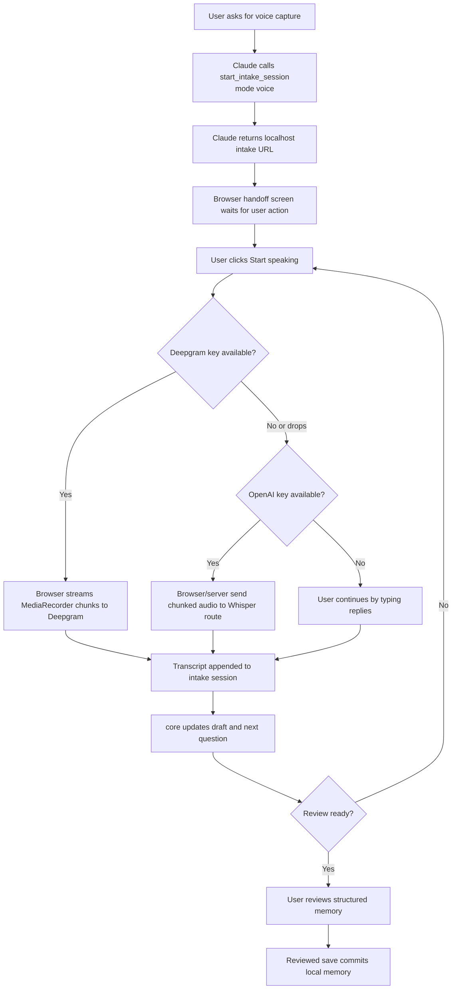
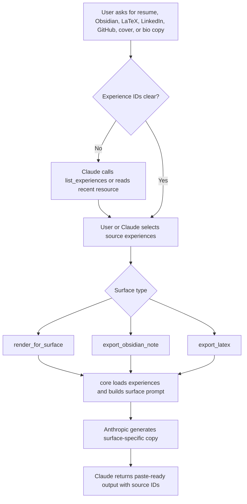
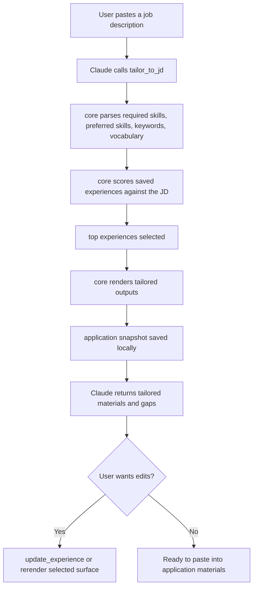
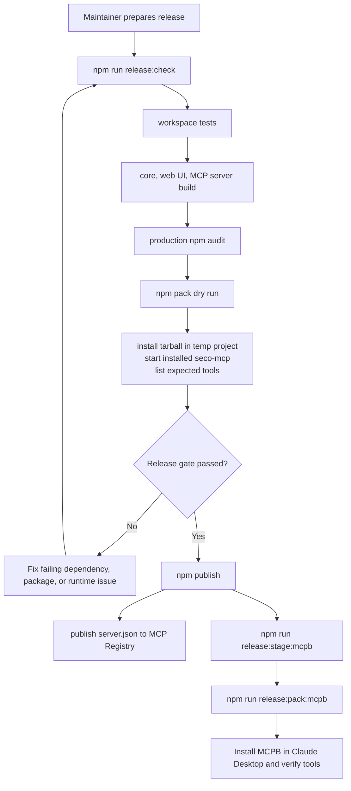

# seco diagrams

Mermaid diagrams for product structure, user journeys, and release flow.

---

## information architecture

```mermaid
flowchart TD
  Product["seco\nlocal professional identity engine"]

  Product --> Entrypoints["User entrypoints"]
  Entrypoints --> ClaudeDesktop["Claude Desktop\nMCP server config"]
  Entrypoints --> ClaudeCode["Claude Code\nproject .mcp.json"]
  Entrypoints --> Browser["localhost browser UI\nvoice fallback and review"]

  Product --> MCPServer["packages/mcp-server\ntransport layer"]
  MCPServer --> Tools["MCP tools\nintake, CRUD, render, tailor, export"]
  MCPServer --> Prompts["Claude Code prompts\ncapture, voice, render, tailor"]
  MCPServer --> Resources["MCP resources\nrecent experiences and snapshots"]
  MCPServer --> HTTP["local HTTP server\n/api, /ws, static UI, audio upload"]
  MCPServer --> MCPApp["MCP App resource\ninline intake card"]

  Product --> Core["packages/core\nbusiness logic"]
  Core --> Config["config\nBYOK keys and seco dir"]
  Core --> Intake["intake\nsessions, questions, draft extraction"]
  Core --> Experience["experience\nCRUD and versioning"]
  Core --> Render["render\nsurface prompt builders and streaming"]
  Core --> Tailor["tailor\nJD parse, scoring, snapshots"]
  Core --> DB["db\nSQLite schema, migrations, optional Supabase adapter"]

  Product --> WebUI["packages/web-ui\ncompanion UI only"]
  WebUI --> IntakeCard["intake app\nprogress, missing fields, review"]
  WebUI --> VoiceUI["voice controls\nMediaRecorder, VAD, handoff"]

  Product --> Data["Local data"]
  Data --> SQLite["~/.seco/seco.db\nexperiences, versions, snapshots, sessions"]
  Data --> Env["~/.seco/.env\nuser-supplied API keys"]

  Product --> Providers["External BYOK providers"]
  Providers --> Anthropic["Anthropic\nextraction and rendering"]
  Providers --> Deepgram["Deepgram\noptional real-time voice"]
  Providers --> OpenAI["OpenAI Whisper\noptional chunked fallback"]
  Providers --> Supabase["Supabase\noptional sync adapter"]

  Product --> Outputs["Output surfaces"]
  Outputs --> Obsidian["Obsidian note"]
  Outputs --> Resume["Resume bullets"]
  Outputs --> LinkedIn["LinkedIn summary or post"]
  Outputs --> GitHubReadme["GitHub README"]
  Outputs --> Latex["LaTeX bullets"]
  Outputs --> Cover["Cover letter paragraph"]
  Outputs --> Bio["Short, medium, full bio"]

  Product --> Distribution["Distribution"]
  Distribution --> Npm["npm package\nnpx seco-mcp"]
  Distribution --> Registry["MCP Registry metadata\nserver.json"]
  Distribution --> MCPB["MCPB bundle\nstaged local install"]
```

## user flow: guided text intake

## user flow: voice intake fallback

## user flow: render or export a saved experience

## user flow: tailor to a job description

## user flow: release and distribution

